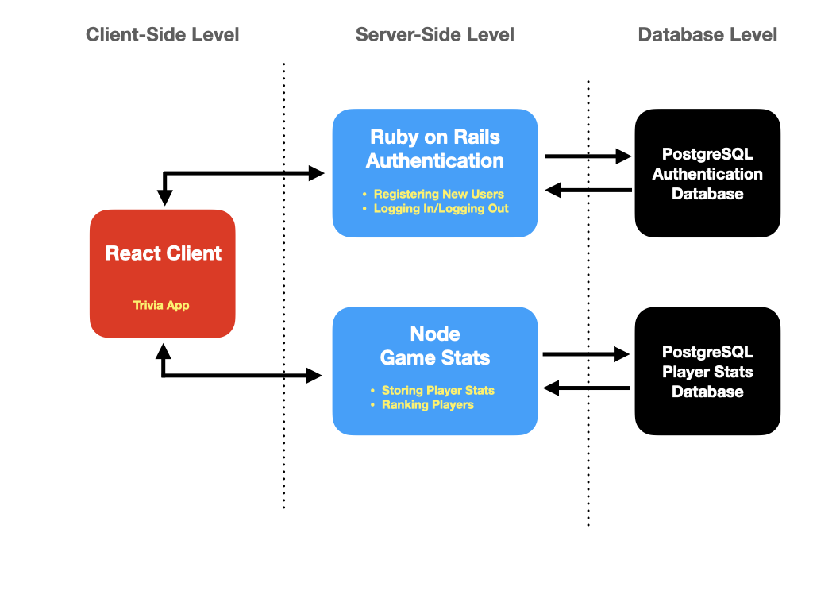

# React Trivia Night App

The app is live at: [React Trivia Night App](https://aeb-react-trivia-app.netlify.app/ "React Trivia Night App")

## Motivation
My friends and I love to play trivia, but even before the pandemic, we found it hard to arrange our schedules to play in person. This game makes it easy for anyone to play trivia online, alone or with friends.

## Current Features

### Non-Member Features
- Users can play an unlimited number of free trivia games, from a database of over 14,500 queations.
- Each game consists of five randomly-chosen questions, with 20 seonds per question.
- Users receive immediate feedback to let them know if their answer was correct. At the end of the game, a table will appear with details of each question, the correct answers, and how their answers compared.

The game is completely free to play. Membership is optional, but does provide additional features.

### Member features
**All non-member features, plus:**

- **Free membership:** Users can join for free and create their own unique username.
- **Track your performance:** Users can view their lifetime stats, including total questions answered, total correct, and total incorrect, on a personal dashboard page.
- **Custom games:** users can choose from a large number of categories, with different levels of difficulty, and a range of 1-50 questions per game.

## Planned Upcoming Features
- **Multiplayer games:** users can play against each other in the same game rooms
- **Game Leaderboards:** users can compare their stats to others players
- **Plan Games:** users can schedule future matches with other users

## User Flows
- **Home Page**
  - Quick Game: Users can play unlimited 5-question games without joining, but they must join to save their game stats (membership is free).
  - Register: New users can join for free.
  - Sign In: Returning users can log in.
- **User Dashboard**
  -  After authentication, users will be taken to a dashboard page, where they will have the option to play a game, or view their stats. 
    - Start a quick game, with five randomly-chosen questions, or create custom games
    - View Stats
      - Users can view their stats:
        - Total questions answered
        - Total number of correct answers
        - Total number of incorrect answers

## External APIs and Libraries
- **Open Trivia DB:** https://opentdb.com - A free, user-contributed database of trivia questions, with over 14,500 questions.

- [Rails Authentication App](https://github.com/XiaoA/rails-authentication-app): A simple authentication system for this game, backed by Rails and PostgreSQL. This could also be replaced with another authentication system. Stores emails, passwords, and a username for members; only the username and a UUID number are shared with the application.
- [Node Player Stats App](https://github.com/XiaoA/react-trivia-node-player-stats-server): A dedicated Node.js server and PostgreSQL database, decoupled from the autnetication system. Stores player stats.

## Architecture

## Core Technology Stack
### **Front End:** 
- React.js

### **Back End:** 
- Authentication:
  - Ruby on Rails, PostgreSQL
- Player's Game Stats:
  - Express.js, PostgreSQL

## Testing Strategies
### Unit Testing
- Reacting Testing Library

### Integration/End-to-End
- Cypress

### Mocking
- Mock Service Worker

## Installation
This app was built as a microservice, with three components. To run this app locally, you'll need to make sure that you have the following installed on your system:

1. Node 16.13.1
2. Ruby 3.1.0
3. Rails 7.0.2.2
4. PostgreSQL 13

### Client React App
1. Clone this repo.
2. `npm install` or `yarn add`
3. `npm start` or `yarn`
4. By default, this app will run on http://localhost:3000.

### Rails Authentication App
1. Go to https://github.com/XiaoA/rails-authentication-app 
2. Clone the repo.
3. Ensure that you have the correct version of Ruby installed (3.0.2).
4. `bundle install`
5. By default, this app will run on http://localhost:3001.

### Node Player Stats App
1. Go to https://github.com/XiaoA/react-trivia-node-player-stats-server
2. Ensure that you have the correct version of Node installed
3. `npm install` or `yarn`
4. By default, this app will run on http://localhost:5000

